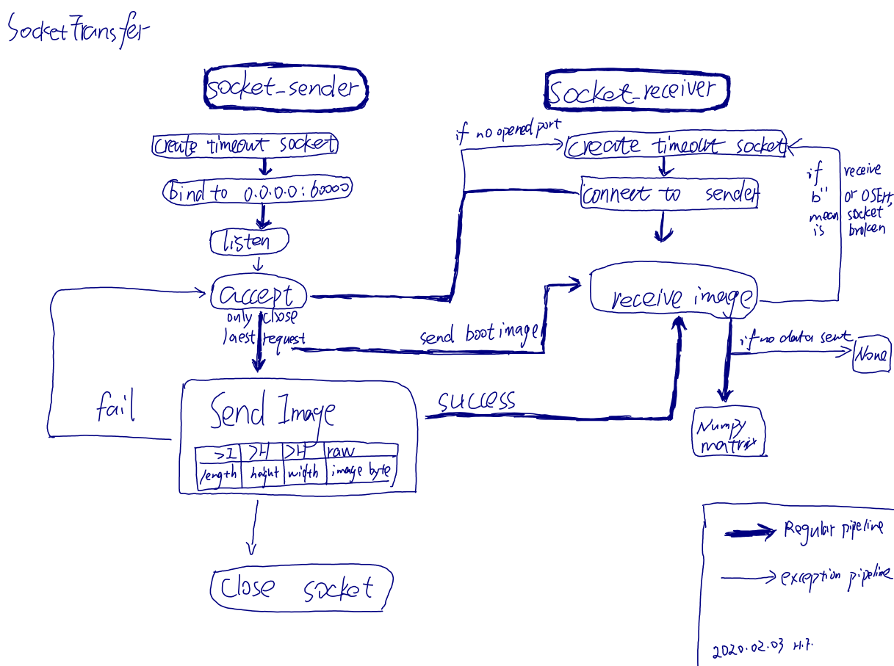
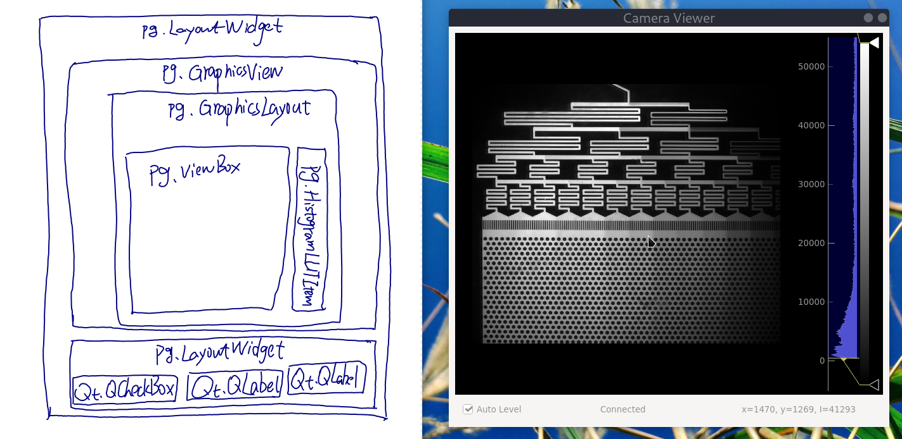

# SocketViewer
Module to transfer image, sync variables using socket(TCP), and visualize tool
based on this module.

## Requirements
Python 3, pyqtgraph-0.11.0 is required for `CameraViewer.py` and `ParameterViewer.py`

``` bash
sudo pip3 install git+https://github.com/pyqtgraph/pyqtgraph@develop
```

## Roadmap
2020/02/02: Add intensity picker, connection status label in `CameraViewer.py`.
Add reconnection support to handle connection interruption.

## Design 

`SocketTransfer.py`


`CameraViewer.py`


SocketSync.py

## Files List

| Files              | Description
|--------------------|------------------------------------------------
| SocketTransfer.py  | Socket library transfers camera frame for CameraViewer.py
| CameraViewer.py    | Receive and visualize camera frame from socket
| ParameterViewer.py | Microscopy parameter viewer and controller
| SocketSync.py      | Socket library synchronizes parameters for ParameterViewer.py
| test.tif, test2.tif| 16 bit grey image  for test

## Reference Material

https://docs.python.org/3.7/howto/sockets.html

https://keelii.com/2018/09/24/socket-programming-in-python/

https://gist.github.com/JiangXL/c4b3e34ff66fb8e8b92d3f9103e6a29c

https://docs.python.org/3/library/socket.html
